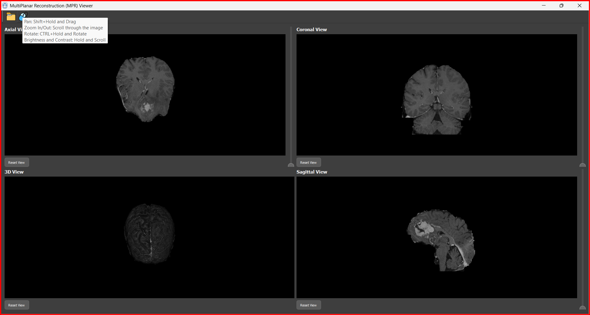
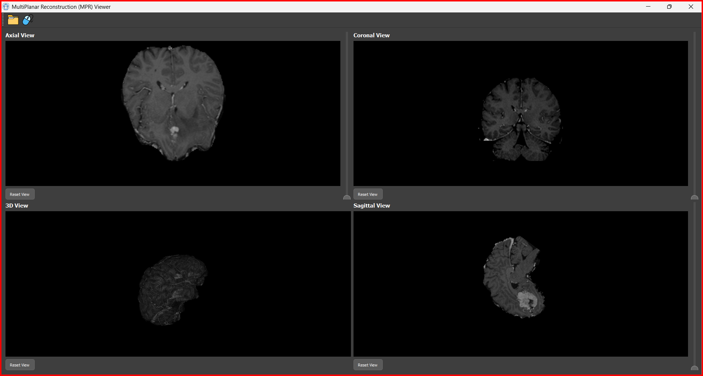

# Multi-Planar Reconstruction (MPR) Viewer

# Overview

The **Multi-Planar Reconstruction (MPR) Viewer** is a powerful desktop application designed for visualizing and interacting with medical images in multiple planes, supporting both **DICOM** and **MHD** formats. It provides an intuitive interface for exploring **3D volumes** along with their **2D projections**, offering enhanced diagnostic and research capabilities.


---

# Features

###  Multi-Planar Viewports
- **Simultaneous Viewports:** Displays **axial, coronal, and sagittal** slices of a 3D volume.
- **3D Model View:** Interactive panel for rendering and manipulating the **3D model**.
- **Real-time Updates:** Synchronizes **slice positions** across all viewports and the 3D model.

###  Navigation Features
- **Slice Scrolling:** Navigate through slices using the **mouse scroll** or **keyboard**.
- **Slice Indication:** Highlights the current slice across all views for better orientation.

###  Image Manipulation
- **Zoom:** Adjust zoom levels using the **scroll wheel** or dedicated controls.
- **Pan:** `Shift + Hold and Drag` to move across the image.
- **Rotate:** `CTRL + Hold and Rotate` for enhanced 3D visualization.
- **Brightness/Contrast Control:** `Hold and Scroll` to fine-tune image clarity.

###  Point Localization
- **3D Volume Point Selection:** Click on a point in any view to see its corresponding **location in all perspectives**.

###  Layout & Controls
- **Four Panels:**
  -  **Axial View**
  -  **Coronal View**
  -  **Sagittal View**
  -  **3D Model View**
- **Slider:** Adjusts slice position dynamically.
- **Reset Button:** Restores views to their **initial states**.


| **Respective Slices in each view** | 
|------------------------------------|
|  | 

|**Zoom, Rotate, Contrast** |
|----------------------------|
| |


---


## Required Libraries

To run the application, install the following libraries:

```bash
pip install PyQt5
pip install pydicom
pip install VTK

 ```
## Usage

To run the application, use the following command:

```bash
python MPR.py
```

1. **Upload Images:** Load **DICOM/MHD** files using the toolbar.
2. **Navigate Slices:** Scroll through slices and observe their positions across all views.
3. **Manipulate Images:**
   - 🖱️ **Pan:** `Shift + Hold and Drag`
   - 🔍 **Zoom:** Scroll to zoom in/out.
   - 🔄 **Rotate:** `CTRL + Hold and Rotate`
   - ☀️ **Brightness/Contrast:** `Hold and Scroll` to adjust.
4. **Point Localization:** Click a point in any view to see its position in the **3D model**.
5. **Reset Views:** Click the **reset button** to restore the default layout.
   
---
## 📂 Folder Structure

```bash
MultiPlanar-Reconstruction
├── MPR.py       # Entry point of the application
├── 📂 data_example   # a sample data for testing
├── 📂 Icons          # Icons, styles, and other assets
└── README.md         # This file
```


##  Acknowledgments

We extend our heartfelt gratitude to **Dr. Tamer Basha** for his invaluable guidance and expertise throughout the development of this project. His insightful feedback has significantly contributed to refining both the functionality and design of the application.

Additionally, we appreciate the contributions of the **open-source community** for providing the essential tools and libraries that made this project possible. Their efforts in advancing medical imaging technologies have been instrumental in shaping this application. 

---
🙏 *Thank you for your support and contributions!* 
